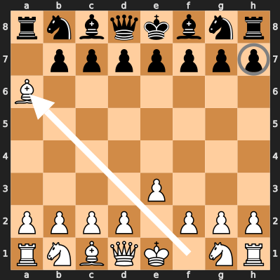
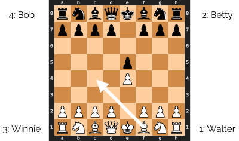
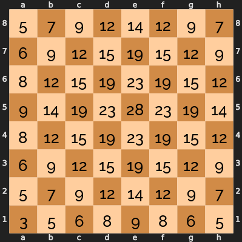
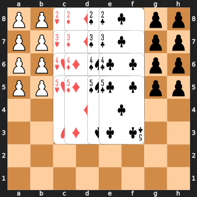

### Introduction
These are new games that aren't ready yet. You can try them out and let me
know what you think.

## Table of Contents
* [Manna Chess][manna-chess] adds random power ups to chess. (2
    players, chess set, checkers set, and 2 dice)
* [Cloak and Dagger Chess][cloak-and-dagger-chess] is a game where you
    disguise your chess pieces as checkers, then try to identify your
    opponent's pieces. (2 players, chess set, checkers set, pen, and tape)

[manna-chess]: #manna-chess
[cloak-and-dagger-chess]: #cloak-and-dagger-chess

# New Games
These games are in early development or playtesting. The rules might get more
filled out or change based on feedback from players.

## Manna Chess
The god of war drops manna after every capture, and manna can make any piece a
king. This game adds a little chaos to chess, and accelerates the end game.

### Equipment
A standard chess set, a standard set of 24 checkers, and two dice. The checkers
must be stackable, and you must be able to stack a chess piece on top of the
checkers. Coins or poker chips would also work, as long as they fit inside the
chess board squares.

### Setup
Set up the chess pieces in the standard start position, and randomly choose who
will play white. Place the 24 checkers and the dice beside the board.

### Play
All the regular chess rules apply, plus you get to drop manna after one of your
pieces is captured. If one or more of your pieces were just captured, start your
turn by pointing to one of the four corners of the board. Then roll two dice to
decide which file (column) the manna will land on. The corner you're pointing to
is 3, then count up across the board to the number you rolled. Rolls of 2, 11,
or 12 miss the board, and you get no manna. Then roll the two dice again to
decide which rank (row) the manna will land on. Again, you're pointing at 3,
and count up across the board to 10. If manna lands on the board, add a checker
to that square. The colour of the checker doesn't matter. If that square has a
chess piece or other checkers on it, add the new checker to the stack.

In the following example, white just captured a pawn with the bishop, so now
black points to the bottom-left corner and rolls a 7 and a 6. Counting from the
left, the 7 puts it on the e file. Counting from the bottom, the 6 puts it on
e4.

Checkers or stacks of checkers without a chess piece on them are neutral manna
pieces that can be captured by either player. When you capture them, stack your
capturing piece on top. You cannot jump over manna, except with a knight. When
you capture an opponent's piece, you keep any manna they were carrying.

Captured manna are carried with the chess piece on top when you move the chess
piece. If one of your pieces has manna after you move it, you may eat one of
those manna and make an extra king move with that piece. Eat a manna by
removing it from the stack and putting back in the supply beside the board. If
the piece still has manna, you may continue making king moves until you run out.

For example, in this position, the pawns at e3 and e5 cannot capture the manna
at e4. However, the white pawn at d3 can. Once it captures the manna, it could
immediately eat it and capture the pawn at e5 with a king's move. That would be
a poor choice, though, because the pawn at d6 could capture it back.

White decides to capture the manna, but not eat it.

### Winning
Win by capturing the king, either with a regular move or with a manna move. You
must call check or check mate if you can, but it's possible for a lucky manna
drop to allow a capture when you couldn't call check mate on the previous turn.

### Manna Strategy
Because 7 is the most common roll with two dice, you have some control over
where the manna will drop when you choose which corner to count from. For
example, if you chose the bottom-left corner 1000 times, here are how many times
you would expect the manna to land in each square:

You would also expect to miss the board 210 times, so you will add a piece of
manna roughly 8 out of 10 times you roll.

You can see that the most likely square is the centre square opposite the corner
you start counting in, so check which squares you occupy or can attack before
you roll for manna.

# Broken Games
These ideas seemed promising, but didn't work at the table. Maybe I'll come back
to them, if I get inspired. Masquerade Chess seemed broken for 15 years, before
I had the idea to hide only the capture moves.

## Cloak and Dagger Chess
Pawns are played as usual, but all other pieces are replaced by numbered
checkers. Players have to deduce which of their opponent's pieces are which, and
then capture the king.

### Setup
Place all the pawns in their regular position, then use tape or stickers to
write the numbers 1 to 8 on checkers for each player. Put the black checkers on
black's back row and the light checkers on white's back row. Finally, write two
grids like this to secretly record your pieces and deduce your opponent's:

Obviously, you don't have to put the pieces in their standard starting
positions, but you do have to have a standard set of pieces. (You can't give
yourself three queens!) You also have to follow the same restrictions that
Chess960 puts on its random starting positions:

* Place your king somewhere between your two rooks.
* Place one of your bishops on a light square and one on a dark square.
 
Write a circle for each piece you know, and an X for each piece you
know is impossible. You might want to write X's for your own pieces as your
opponent learns which of your combinations are impossible.

Here's one possible way to fill in your grid at the start of the game:

At the start of your turn, you may guess the identity of one of your opponent's
checkers. If you guess correctly, you may make a bonus move after your regular
move. Your bonus move may be either a regular pawn move or to take back a pawn
that your opponent captured and drop it on an empty square in your second rank.
If you guess incorrectly, your opponent may make the same kind of bonus move
before their next turn.

At the end of your turn, you may replace any number of your checkers with their
uncloaked chess pieces.

If one of your checkers is captured, tell your opponent which piece they
captured.

### Winning
Win by capturing a cloaked king or putting an uncloaked king in checkmate. You
might have to uncloak some of your pieces to show the checkmate.

A cloaked king may move into check, stay in check, or castle out of check,
because the opponent doesn't know it's in check. Castling is the same as in
Chess 960: the king and rook end up on the same squares they do in standard
chess. All spaces between their start position and their end position must be
empty, except for the king and the castling rook. All spaces between the king's
start and end positions must not be under attack, if the king is uncloaked.

### Design Problems
Because you don't know how your opponent's pieces capture, you never know if
you're safe. You're not even safe from the pawns, because your opponent can
sometimes make two pawn moves.

Maybe it's too similar to Masquerade Chess to begin with.

[![cc-logo]][cc-by-sa]

[cc-logo]: images/cc-by-sa.png
[cc-by-sa]: https://creativecommons.org/licenses/by-sa/4.0/
