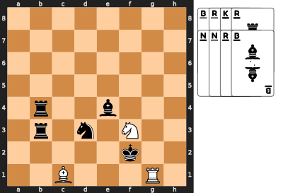
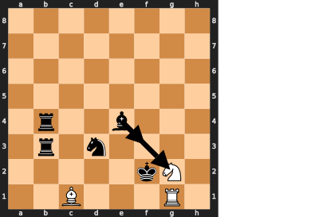

### Introduction
These are new games that aren't ready yet. You can try them out and let me
know what you think.

## Table of Contents
* [Adrenaline Chess][adrenaline-chess] adds power ups to chess. (2
    players, chess set, and checkers set)
* [Booster Chess][booster-chess] use cards to boost your chess army.
    (2 players, chess set, checkers set, and deck of cards)
* [Parade Chess Solitaire][parade-chess-solitaire] pieces move each
    other into a connected group. (1 player, chess set, and deck of cards)
* [Neighbour Chess Solitaire][neighbour-chess-solitaire] moves pieces
    using their neighbours' moves to form one connected group. (1 player,
    chess set, and deck of cards)
* [Cloak and Dagger Chess][cloak-and-dagger-chess] is a game where you
    disguise your chess pieces as checkers, then try to identify your
    opponent's pieces. (2 players, chess set, checkers set, pen, and tape)

[adrenaline-chess]: #adrenaline-chess
[booster-chess]: #booster-chess
[parade-chess-solitaire]: #parade-chess-solitaire
[neighbour-chess-solitaire]: #neighbour-chess-solitaire
[cloak-and-dagger-chess]: #cloak-and-dagger-chess

# New Games
These games are in early development or playtesting. The rules might get more
filled out or change based on feedback from players.

## Adrenaline Chess
What if taking your opponent's piece frightened the others so much that they
became more aggressive? Every time you take a piece, you have to choose one of
the remaining pieces to get an adrenaline rush, and adrenaline can make any
piece a king. This game adds a little chaos to chess, and accelerates the end
game.

### Equipment
A standard chess set and a standard set of 24 checkers. The checkers
must be stackable, and you must be able to stack a chess piece on top of the
checkers. Coins or poker chips would also work, as long as they fit inside the
chess board squares.

### Setup
Set up the chess pieces in the standard start position, and randomly choose who
will play white. Place the checkers beside the board.

### Play
All the regular chess rules apply, plus you must give an adrenaline rush after
captures. If you captured one or more pieces, end your turn by placing a
checker under one of your opponent's remaining pieces. The colour of the
checker doesn't matter, and you may stack multiple checkers under a piece.

In the following example, white just captured a pawn with the bishop, and
finishes the turn by adding a checker under the pawn at h7.

To move a piece with checkers under it, you must make a regular move for that
piece, and bring the checkers along. Then you may use up one of the checkers
under that piece to make an extra move like a king. Remove a checker from the
stack, and move the rest one space in any direction. If that piece still has
checkers under it, you may continue making extra king moves until the piece
runs out of checkers.

The extra moves may capture pieces, but you only ever add one checker per turn.
When you capture an opponent's piece, your capturing piece keeps any adrenaline
the captured piece had, and may immediately use the adrenaline.

For example, here is a strange checkmate that uses white's adrenaline to
threaten the white king. Black has just captured a pawn, and has spent the last
few turns pumping a trapped bishop full of adrenaline. Adding a third checker
to the stack at c1 would seem to make the bishop a threat to the black queen,
but it must make a regular move before it can start using the adrenaline. White
has been forced to keep the king retreating, and hasn't been able to move the
pawns that would free the bishop. The black queen on the other hand, will be
able to capture the bishop on the next turn, and then use those three checkers
to capture the king at f2, possibly capturing the pawn at d2 along the way.
Moving the king to e1 or e3 would still be in range for the queen. e2 would be
a direct capture by the queen, f1 and f3 could be captured by the queen or the
black bishop. g3 might give a glimmer of hope, until you notice that the black
pawn at h5 has a checker. It is checkmate.

After castling, you may use both the king and the rook for extra moves, if they
both have checkers. During castling, you may not move your king through squares
that could be attacked by extra moves. You may capture a pawn en passant on the
at the usual square after a regular move of two squares. You may not capture en
passant if the pawn used an extra move, and you may not use an extra move to
capture en passant. A pawn that moves to the back rank immediately promotes, and
may continue making king moves if it still has checkers. You may not move a
piece to reveal a check on your king, even if you then use an extra move to
block the check again.

### Winning
Win by checkmate, as in regular chess, but you may use extra moves to threaten
the king.

## Booster Chess
Start every game with a booster pack of cards to make your pieces better or
hobble your opponent's pieces.

### Equipment
A standard chess set, a standard checkers set, and a standard deck of cards.

The checkers must be stackable, and you must be able to stack a chess piece on
top of the checkers. Coins or poker chips would also work, as long as they fit
inside the chess board squares. You only need 6 of each colour.

From the deck of cards, use one card to represent each piece, as shown in
appendix A. You also need two cards of each colour to represent checkers, so add
the sixes to the deck. That should make 36 cards in total, put the rest of the
deck aside.

### Setup
Set up the chess pieces in the standard start position, and randomly choose who
will play white. Place 6 light checkers in front of White and 6 dark checkers in
front of Black. You won't need the rest of the checkers, so put them aside.

Shuffle the deck and deal 6 cards to each player. Look at your cards, but don't
show them to your opponent.

### Play
Chess pieces move normally, unless they are stacked on checkers. Pieces on
checkers are modified as follows:

* Your piece on your checker is boosted: after making a normal move, you may
  make an extra move like a king, one space in any direction. If you make the
  king's move, remove the checker, and place it in front of you.
* Your piece on your opponent's checker is hobbled: pawns cannot move at all,
  and other pieces move like pawns.

Pieces may be modified by more than one checker as follows:

* If your piece has more than one boost, you may spend as many of the booster
  checkers as you wish, and make one king's move for each one, all in one turn.
* One piece may not have more than one hobble.
* A hobbled piece with boosters must make a legal move before spending any
  boosters. That means that a hobbled pawn usually can't spend a booster, and
  other hobbled pieces must move like a pawn before spending a booster.

When you move a piece, it brings any checkers along with it, except a spent
booster.

#### Adding and Transferring Checkers
After you finish moving, you may play one of your cards to add a checker. You
may only add checkers of your own colour, and you may add one to a piece that
matches the card. Checkers cards match any piece of that colour, so you may use
a black checker card to add one of your checkers to any black piece or use a
white checker card to add one of your checkers to any white piece.

When you capture a piece, your piece keeps any checkers that the captured piece
was stacked on. Capturing a boosted piece leaves you hobbled, but capturing a
hobbled piece leaves you boosted! A newly boosted piece may immediately spend
that booster. This is the one case where a hobbled pawn may spend a booster,
because it made a legal move just before getting hobbled.

You may, instead of moving a piece, transfer a hobble checker from one of your
pieces to one of your neighbouring pieces. For example, you might want to move
a hobble from your queen to one of your pawns, so you can use your queen
normally.

There is one other way to remove a hobble checker: get to the back rank of the
board. If you do, just remove the hobble checker and return it to your opponent.
Hobbled pawns that reach the back rank remove the hobble checker and then
promote.

#### Drawing Cards
After moving a piece and possibly playing a card, draw cards until you have the
same number of cards as checkers off the board. In practice, this means that
you only draw if you spent a booster checker or received a hobble checker from
your opponent.

#### Special Cases
After castling, you may use both the king and the rook for booster moves, if
they are both boosted. During castling, you may not move your king through
squares that could be attacked by booster moves. You may capture a pawn en
passant at the usual square after a regular move of two squares. You may not
capture en passant if the pawn used a booster move, and you may not use a
booster move to capture en passant. A pawn that moves to the back rank
immediately promotes, and may continue making booster moves if it is still
boosted. You may not move a piece to reveal a check on your king, even if you
then use a booster move to block the check again.

### Winning
Win by checkmate, as in regular chess, but you may use booster moves to threaten
the king.

### Variants
Make the game more predictable by using fewer checkers cards in the deck or
fewer checkers during setup. Make it less predictable by using more. Handicap a
player by giving them fewer checkers than their opponent. During setup, always
deal one card for each checker.

## Parade Chess Solitaire
Half the chess pieces are on parade, giving each other orders, and they have to
form up into one connected group. Keep adding pieces until you have enough to
start, but you get more points for fewer pieces making fewer moves.

### Equipment
A standard chess set and a standard deck of 52 cards.

### Setup
Place all the chess pieces except the pawns beside the board. Put the pawns
away, you won't need them.

From the deck of cards, use one card to represent each piece, as shown in
appendix A. You don't need the pawn cards, so you should end up with 16 cards.

Put the rest of the cards away, you won't need them. Then shuffle the cards and
deal them into two piles of eight next to the board. From one of the piles, draw
one card at a time, placing the matching piece on the board. Starting at a1
through h1, then a2 through h2, and so on until you've placed eight pieces on
the board. The table in appendix A shows how big a gap to leave before each
piece. That is, how many empty squares to leave before placing each piece.

Here's an example with all the cards laid out in the order they were drawn, from
the 9 and 10 of hearts to the 9 of spades. Check to make sure you agree with
where the pieces were placed.

### Play
Take the remaining stack of eight cards, and spend them on actions to bring the
chess pieces together. Each card can be spent on one of two actions:

1. **Move** a piece. Take the top card from your deck and play it face down next
   to the discard pile from the setup phase. Then use one of the pieces on the
   board to move another piece. A piece can move any piece of the opposite
   colour from a square that it could attack in regular chess. Pick up the piece
   that you want to move, and then place it in another square that piece moving
   it could attack. For example, black knight at d3 could move the white bishop
   from c1 to b2, e1, f4, e5, or c5. The king could move either of the white
   pieces next to it to any of the other spaces next to it.
2. **Add** a piece. Take the top card from your deck and play it face up onto
   the discard pile from the setup phase. Add the piece as in the setup phase,
   leaving the regular gap after the piece that is in the occupied rank farthest
   from 1 and in the rightmost file of that rank. In the example above, if you
   played the 8 of diamonds, you would play a white knight at g7 to leave a
   one-square gap after the black bishop.

Here's an example of using the black bishop at e4 to move the white knight from
f3 to g2:

### Winning
If you can get from any piece to any other piece on the board only stepping on
neighbouring pieces, then you have formed one connected group and you win.
Diagonal neighbours don't count. Count how many cards you have left in your
hand, and that's how many points you win.

If you run out of cards before you form one connected group, pick up all 16
cards, and use them to count negative points until you form a connected group.
You may only move pieces and not add any.

# Broken Games
These ideas seemed promising, but didn't work at the table. Maybe I'll come back
to them, if I get inspired. Masquerade Chess seemed broken for 15 years, before
I had the idea to hide only the capture moves.

## Neighbour Chess Solitaire
Pairs of chess pieces help each other across the board until you gather them all
into one connected group. Keep adding pieces until you have enough to start, but
you get more points for fewer pieces making fewer moves.

This game might not be broken, but it inspired Chess Golf, and they're too
similar to keep both.

### Equipment
A standard chess set and a standard deck of 52 cards.

### Setup
Place all the chess pieces except the pawns beside the board. Put the pawns
away, you won't need them.

From the deck of cards, create two smaller decks. The first is a deck of 16
cards for the chess pieces, as shown in appendix A. You don't need the pawn
cards.

The second is a deck for the positions on the board: 2 - 6 of Hearts, Diamonds,
Spades, and Clubs.

Put the rest of the cards away, you won't need them. Then shuffle each deck and
place them next to the board as the two draw piles.

### Play
In the first part of the game, you add pieces to the board, as directed by the
two decks of cards.

1. Flip over the top card of the pieces deck and place it on a discard pile.
2. Take the piece that matches that card, and hold it above the board. If it's
   the first piece, hold it above the bottom left corner. Otherwise, hold it
   above the last piece you added. (Check the discard pile, if you forget which
   piece you added last.)
3. Flip over the top card of the positions deck and place it on a second discard
   pile.
4. Now move the piece from the square it's above to a new square and add it to
   the board. If the position card is a red card, move the piece that many
   squares to the right, otherwise move the piece that many squares up. If you
   move off the edge of the board, loop around to the opposite side and keep
   counting.
5. If the space you move to is occupied, you may move to any of the 8 neighbour
   spaces. If all of them are occupied, you may move to any of their neighbours,
   and so on. You may not wrap around the edge of the board in this case, so
   edges and corners have fewer than 8 neighbours.

After adding any piece, you may choose to stop adding and try to move the pieces
into one connected group.

1. Before each move, spend a card from one of the draw piles to a discard pile.
2. Then move one of the chess pieces. However, it doesn't use its usual move.
   Instead, use the move of one of its neighbours of the same colour in the 8
   squares around it. If a piece has no neighbours of the same colour, it cannot
   move.

### Winning
If you can get from any piece to any other piece on the board only stepping on
neighbouring pieces, then you have formed one connected group and you win. Count
how many cards you have left in the two draw piles, and that's how many points
you win.

## Cloak and Dagger Chess
Pawns are played as usual, but all other pieces are replaced by numbered
checkers. Players have to deduce which of their opponent's pieces are which, and
then capture the king.

### Setup
Place all the pawns in their regular position, then use tape or stickers to
write the numbers 1 to 8 on checkers for each player. Put the black checkers on
black's back row and the light checkers on white's back row. Finally, write two
grids like this to secretly record your pieces and deduce your opponent's:

Obviously, you don't have to put the pieces in their standard starting
positions, but you do have to have a standard set of pieces. (You can't give
yourself three queens!) You also have to follow the same restrictions that
Chess960 puts on its random starting positions:

* Place your king somewhere between your two rooks.
* Place one of your bishops on a light square and one on a dark square.
 
Write a circle for each piece you know, and an X for each piece you
know is impossible. You might want to write X's for your own pieces as your
opponent learns which of your combinations are impossible.

Here's one possible way to fill in your grid at the start of the game:

At the start of your turn, you may guess the identity of one of your opponent's
checkers. If you guess correctly, you may make a bonus move after your regular
move. Your bonus move may be either a regular pawn move or to take back a pawn
that your opponent captured and drop it on an empty square in your second rank.
If you guess incorrectly, your opponent may make the same kind of bonus move
before their next turn.

At the end of your turn, you may replace any number of your checkers with their
uncloaked chess pieces.

If one of your checkers is captured, tell your opponent which piece they
captured.

### Winning
Win by capturing a cloaked king or putting an uncloaked king in checkmate. You
might have to uncloak some of your pieces to show the checkmate.

A cloaked king may move into check, stay in check, or castle out of check,
because the opponent doesn't know it's in check. Castling is the same as in
Chess 960: the king and rook end up on the same squares they do in standard
chess. All spaces between their start position and their end position must be
empty, except for the king and the castling rook. All spaces between the king's
start and end positions must not be under attack, if the king is uncloaked.

### Design Problems
Because you don't know how your opponent's pieces capture, you never know if
you're safe. You're not even safe from the pawns, because your opponent can
sometimes make two pawn moves.

Maybe it's too similar to Masquerade Chess to begin with.

[![cc-logo]][cc-by-sa]

[cc-logo]: images/cc-by-sa.png
[cc-by-sa]: https://creativecommons.org/licenses/by-sa/4.0/
