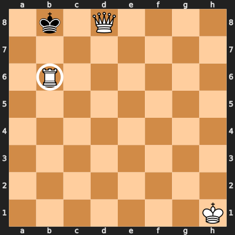

### Introduction
These are new games that aren't ready yet. You can try them out and let me
know what you think.

## Table of Contents
* [Adrenaline Chess][adrenaline-chess] adds power ups to chess. (2
    players, chess set, and checkers set)
* [Cooperative Chess][cooperative-chess] lets you play together
    against the game. (2 players, chess set, and deck of cards)
* [Cloak and Dagger Chess][cloak-and-dagger-chess] is a game where you
    disguise your chess pieces as checkers, then try to identify your
    opponent's pieces. (2 players, chess set, checkers set, pen, and tape)

[adrenaline-chess]: #adrenaline-chess
[cooperative-chess]: #cooperative-chess
[cloak-and-dagger-chess]: #cloak-and-dagger-chess

# New Games
These games are in early development or playtesting. The rules might get more
filled out or change based on feedback from players.

## Adrenaline Chess
What if taking your opponent's piece frightened the others so much that they
became more aggressive? Every time you take a piece, you have to choose one of
the remaining pieces to get an adrenaline rush, and adrenaline can make any
piece a king. This game adds a little chaos to chess, and accelerates the end
game.

### Equipment
A standard chess set and a standard set of 24 checkers. The checkers
must be stackable, and you must be able to stack a chess piece on top of the
checkers. Coins or poker chips would also work, as long as they fit inside the
chess board squares.

### Setup
Set up the chess pieces in the standard start position, and randomly choose who
will play white. Place the checkers beside the board.

### Play
All the regular chess rules apply, plus you must give an adrenaline rush after
captures. If you captured one or more pieces, end your turn by placing a
checker under one of your opponent's remaining pieces. The colour of the
checker doesn't matter, and you may stack multiple checkers under a piece.

In the following example, white just captured a pawn with the bishop, and
finishes the turn by adding a checker under the pawn at h7.

To move a piece with checkers under it, you must make a regular move for that
piece, and bring the checkers along. Then you may use up one of the checkers
under that piece to make an extra move like a king. Remove a checker from the
stack, and move the rest one space in any direction. If that piece still has
checkers under it, you may continue making extra king moves until the piece
runs out of checkers.

The extra moves may capture pieces, but you only ever add one checker per turn.
When you capture an opponent's piece, your capturing piece keeps any adrenaline
the captured piece had, and may immediately use the adrenaline.

For example, here is a strange checkmate that uses white's adrenaline to
threaten the white king. Black has just captured a pawn, and has spent the last
few turns pumping a trapped bishop full of adrenaline. Adding a third checker
to the stack at c1 would seem to make the bishop a threat to the black queen,
but it must make a regular move before it can start using the adrenaline. White
has been forced to keep the king retreating, and hasn't been able to move the
pawns that would free the bishop. The black queen on the other hand, will be
able to capture the bishop on the next turn, and then use those three checkers
to capture the king at f2, possibly capturing the pawn at d2 along the way.
Moving the king to e1 or e3 would still be in range for the queen. e2 would be
a direct capture by the queen, f1 and f3 could be captured by the queen or the
black bishop. g3 might give a glimmer of hope, until you notice that the black
pawn at h5 has a checker. It is checkmate.

After castling, you may use both the king and the rook for extra moves, if they
both have checkers. You may capture a pawn en passant on the second rank at the
usual square after a regular move of two squares. You may not capture en passant
at a square that the pawn left using an extra move, and you may not use an extra
move to capture en passant. A pawn that moves to the back rank immediately
promotes, and may continue making king moves if it still has checkers.

### Winning
Win by checkmate, as in regular chess, but you may use extra moves to threaten
the king.

## Cooperative Chess
If you don't like battling your friend across the board, you can team up against
the game itself. A hand of cards limits what you can capture, and you work
together to eliminate as many *types* of pieces as you can.

### Equipment
A standard chess set and 32 cards from a standard deck of 52 cards. You will use
cards to match the chess pieces:

* White King - King of Hearts
* White Queen - Queen of Hearts
* White Rooks - 10 of Hearts and Diamonds
* White Bishops  - 9 of Hearts and Diamonds
* White Knights - 8 of Hearts and Diamonds
* White Pawns - 2-5 of Hearts and Diamonds
* Black King - King of Spades
* Black Queen - Queen of Spades
* Black Rooks - 10 of Spades and Clubs
* Black Bishops  - 9 of Spades and Clubs
* Black Knights - 8 of Spades and Clubs
* Black Pawns - 2-5 of Spades and Clubs

### Setup
* One player **stands** the chess pieces in the standard start position.
* Meanwhile, the other player **shuffles** the 32 cards,
* **deals** 3 to each player, and
* **places** the rest of the cards next to the board as a draw pile.
* When the chess pieces are set up, the first player secretly places a white
  pawn in one hand and a black pawn in the other. The other player then
  **chooses** a hand to decide their colour.

### Play
White plays the first turn, and then players alternate. Each turn has four
possible steps, in this order:

1. You may make a **non-capturing** chess move.
2. You must **play a card** from your hand to your discard stack.
3. You may make multiple **capturing** chess moves, if the cards allow.
4. You must **draw a card** to bring your hand back to 3.

As the game progresses, you will move the cards between three face-up,
spread-out stacks of cards: White's discards, Black's discards, and the captured
cards. It's best to spread the cards enough that you can see which cards have
already been played.

The chess pieces make the same moves as in regular chess, but you can only
make a capture if the cards match:

1. The **capturing** piece must be the same piece type as the card that the
   capturing player just played, and
2. the **captured** piece must be the same piece type as the top card on the
   other player's discard stack.

Pieces may match cards of either colour. On each turn, all moves must be made
with one piece.

When you capture a piece, remove the piece from the board, and move the captured
piece's card from your partner's discard stack to the captured cards stack. If
you can make another capture move that matches the next card in your partner's
stack, you may continue.

There are two types of **wild** cards that can match any piece type. They may
match different piece types when they capture and when they are captured.

1. If you no longer have any pieces of a certain type, then that type of card is
   wild on your discard stack. For example, if you have no queen, then a queen
   card on your stack lets you capture with any piece and lets your partner
   capture any of your pieces.
2. A double colour match makes the next capture wild. If both the capturing
   piece and the captured piece match the colour of their cards, then the next
   captured card becomes wild, as long as you can capture it in the same turn.
   White pieces match red cards.

Castling is allowed. En passant capture is allowed. You may promote a pawn on
the last rank to any other piece. It can be an effective way to get rid of your
last pawn. You may move a king into check or leave it in check.

### Winning
The game ends immediately when you capture a king. You then get a point for each
piece type that was completely removed from the board, both colours. For
example, if you captured both queens, all four bishops, and a king, but still
had at least one pawn, one knight, one rook, and the other king still on the
board, then you would score 2 points.

If the draw pile is empty, continue playing until you run out of cards in your
hands. If you run out of cards without capturing a king, you lose.

### Talking
The game works best if players know something about each other's cards, but not
everything. They should feel free to ask each other yes or no questions about
their hands and to discuss general strategy, but shouldn't just reveal their
hands.

# Broken Games
These ideas seemed promising, but didn't work at the table. Maybe I'll come back
to them, if I get inspired. Masquerade Chess seemed broken for 15 years, before
I had the idea to hide only the capture moves.

## Cloak and Dagger Chess
Pawns are played as usual, but all other pieces are replaced by numbered
checkers. Players have to deduce which of their opponent's pieces are which, and
then capture the king.

### Setup
Place all the pawns in their regular position, then use tape or stickers to
write the numbers 1 to 8 on checkers for each player. Put the black checkers on
black's back row and the light checkers on white's back row. Finally, write two
grids like this to secretly record your pieces and deduce your opponent's:

Obviously, you don't have to put the pieces in their standard starting
positions, but you do have to have a standard set of pieces. (You can't give
yourself three queens!) You also have to follow the same restrictions that
Chess960 puts on its random starting positions:

* Place your king somewhere between your two rooks.
* Place one of your bishops on a light square and one on a dark square.
 
Write a circle for each piece you know, and an X for each piece you
know is impossible. You might want to write X's for your own pieces as your
opponent learns which of your combinations are impossible.

Here's one possible way to fill in your grid at the start of the game:

At the start of your turn, you may guess the identity of one of your opponent's
checkers. If you guess correctly, you may make a bonus move after your regular
move. Your bonus move may be either a regular pawn move or to take back a pawn
that your opponent captured and drop it on an empty square in your second rank.
If you guess incorrectly, your opponent may make the same kind of bonus move
before their next turn.

At the end of your turn, you may replace any number of your checkers with their
uncloaked chess pieces.

If one of your checkers is captured, tell your opponent which piece they
captured.

### Winning
Win by capturing a cloaked king or putting an uncloaked king in checkmate. You
might have to uncloak some of your pieces to show the checkmate.

A cloaked king may move into check, stay in check, or castle out of check,
because the opponent doesn't know it's in check. Castling is the same as in
Chess 960: the king and rook end up on the same squares they do in standard
chess. All spaces between their start position and their end position must be
empty, except for the king and the castling rook. All spaces between the king's
start and end positions must not be under attack, if the king is uncloaked.

### Design Problems
Because you don't know how your opponent's pieces capture, you never know if
you're safe. You're not even safe from the pawns, because your opponent can
sometimes make two pawn moves.

Maybe it's too similar to Masquerade Chess to begin with.

[![cc-logo]][cc-by-sa]

[cc-logo]: images/cc-by-sa.png
[cc-by-sa]: https://creativecommons.org/licenses/by-sa/4.0/
