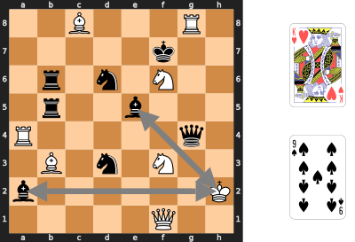
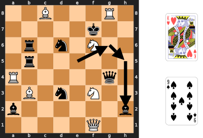
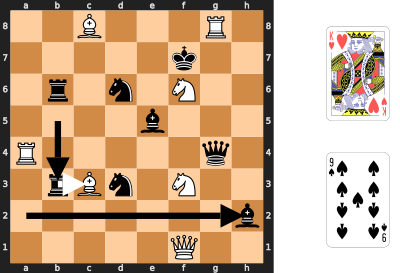
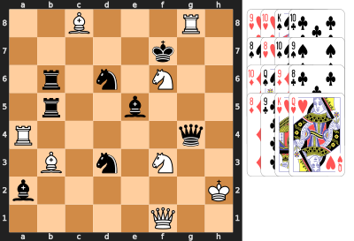
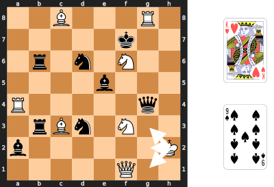

### Introduction
These are new games that aren't ready yet. You can try them out and let me
know what you think.

## Table of Contents
* [Adrenaline Chess][adrenaline-chess] adds power ups to chess. (2
    players, chess set, and checkers set)
* [Chess Golf][chess-golf] makes players race to plan the best route,
    as the pieces caddy each other around the board. (1 or more players,
    chess set, deck of cards, timer, coins, pencil and paper)
* [Neighbour Chess Solitaire][neighbour-chess-solitaire] moves pieces
    using their neighbours' moves to form one connected group. (1 player,
    chess set, and deck of cards)
* [Cloak and Dagger Chess][cloak-and-dagger-chess] is a game where you
    disguise your chess pieces as checkers, then try to identify your
    opponent's pieces. (2 players, chess set, checkers set, pen, and tape)

[adrenaline-chess]: #adrenaline-chess
[chess-golf]: #chess-golf
[neighbour-chess-solitaire]: #neighbour-chess-solitaire
[cloak-and-dagger-chess]: #cloak-and-dagger-chess

# New Games
These games are in early development or playtesting. The rules might get more
filled out or change based on feedback from players.

## Adrenaline Chess
What if taking your opponent's piece frightened the others so much that they
became more aggressive? Every time you take a piece, you have to choose one of
the remaining pieces to get an adrenaline rush, and adrenaline can make any
piece a king. This game adds a little chaos to chess, and accelerates the end
game.

### Equipment
A standard chess set and a standard set of 24 checkers. The checkers
must be stackable, and you must be able to stack a chess piece on top of the
checkers. Coins or poker chips would also work, as long as they fit inside the
chess board squares.

### Setup
Set up the chess pieces in the standard start position, and randomly choose who
will play white. Place the checkers beside the board.

### Play
All the regular chess rules apply, plus you must give an adrenaline rush after
captures. If you captured one or more pieces, end your turn by placing a
checker under one of your opponent's remaining pieces. The colour of the
checker doesn't matter, and you may stack multiple checkers under a piece.

In the following example, white just captured a pawn with the bishop, and
finishes the turn by adding a checker under the pawn at h7.

To move a piece with checkers under it, you must make a regular move for that
piece, and bring the checkers along. Then you may use up one of the checkers
under that piece to make an extra move like a king. Remove a checker from the
stack, and move the rest one space in any direction. If that piece still has
checkers under it, you may continue making extra king moves until the piece
runs out of checkers.

The extra moves may capture pieces, but you only ever add one checker per turn.
When you capture an opponent's piece, your capturing piece keeps any adrenaline
the captured piece had, and may immediately use the adrenaline.

For example, here is a strange checkmate that uses white's adrenaline to
threaten the white king. Black has just captured a pawn, and has spent the last
few turns pumping a trapped bishop full of adrenaline. Adding a third checker
to the stack at c1 would seem to make the bishop a threat to the black queen,
but it must make a regular move before it can start using the adrenaline. White
has been forced to keep the king retreating, and hasn't been able to move the
pawns that would free the bishop. The black queen on the other hand, will be
able to capture the bishop on the next turn, and then use those three checkers
to capture the king at f2, possibly capturing the pawn at d2 along the way.
Moving the king to e1 or e3 would still be in range for the queen. e2 would be
a direct capture by the queen, f1 and f3 could be captured by the queen or the
black bishop. g3 might give a glimmer of hope, until you notice that the black
pawn at h5 has a checker. It is checkmate.

After castling, you may use both the king and the rook for extra moves, if they
both have checkers. You may capture a pawn en passant on the second rank at the
usual square after a regular move of two squares. You may not capture en passant
at a square that the pawn left using an extra move, and you may not use an extra
move to capture en passant. A pawn that moves to the back rank immediately
promotes, and may continue making king moves if it still has checkers. You may
not move a piece to reveal a check on your king, even if you then use an extra
move to block the check again.

### Winning
Win by checkmate, as in regular chess, but you may use extra moves to threaten
the king.

## Chess Golf
All the players try to work out the most efficient way to bring two pieces
together, using all the wrong moves. This game is a series of puzzles, so let's
start with an example:

Every puzzle starts with the pieces spread around the board, and two cards
choosing two types of pieces according to the table in appendix A. The goal is
to make one piece type threaten the other in as few moves as possible. In this
example, you have to make the white king threaten one of the black bishops or
make one of the black bishops threaten the white king.

You might think that the bishop at e5 is already threatening the king, but in
this game, the piece's original movement is irrelevant. Pieces can only
**borrow** the moves of a neighbouring piece in the 8 squares immediately
surrounding them, a bit like a golfer takes a golf club from the caddy standing
next to them. That means that the bishop at e5 can only move like a knight and
the king can't move at all. Also, pieces can only borrow the moves of a
neighbour that's the **same colour**, so the bishop at a2 can't move at all.

Now that you know how the pieces move, here's one possible solution:

The bishop moves like a knight to g6 and then moves like a king to h5. Then it
borrows the queen's move to threaten the king at h2. The solution takes 2 moves.

You're not limited to moving the two chosen piece types. Here's a solution that
doesn't move either of the chosen piece types:

The white bishop uses the rook's move to get out of the way, and then the black
rook comes down to b3. The bishop at a2 can now use the rook's move to threaten
the king. This solution also takes 2 moves.

There are solutions that help the white king threaten a black bishop, but they
take at least 3 moves.

Now that you've seen how to solve one of the puzzles, the rest of the rules
explain how to solve a series of these puzzles with a group of players, keeping
score like a round of golf.

### Equipment
A standard chess set and a standard deck of 52 cards. You'll also need a pencil
and paper for keeping score, a timer, and some coins. 4 coins are probably
enough, and you can even play without them. A one-minute timer works well,
although anything from 30 seconds to two minutes would be fine.

### Setup
Place all the chess pieces except the pawns beside the board. Put the pawns
away, you won't need them.

From the deck of cards, use one card to represent each piece, as shown in
appendix A. You don't need the pawn cards, so you should end up with 16 cards.

Put the rest of the cards away, you won't need them. Then shuffle the cards and
place them next to the board. Draw one card at a time, placing the matching
piece on the board. Starting in the top left corner, leave the following numbers
of empty squares before each piece:

* Kings - 6 empty squares
* Queens - 5 empty squares
* Rooks - 3 empty squares
* Bishops - 2 empty squares
* Knights - 1 empty square

Here's an example with all the cards laid out in the order they were drawn, from
the 9 and 10 of hearts to the queen of hearts. Check to make sure you agree with
where the pieces were placed.

When all 16 pieces are on the board, shuffle the cards again, and place them
next to the board as a draw pile.

Randomly choose a scorekeeper, and get them to write everyone's initials at the
top of the paper, leaving enough room for 9 scores and a course total. Leave
room for 18 scores, if you're playing a full round.

### Play
To start each turn, **check** that at least one white piece has another white
piece it can borrow moves from. Make the same check for at least one black
piece. In the rare case where no pieces of a colour can move, move the king to
the closest square where it has a neighbour of the same colour. In this example
after the second solution above, no white pieces can move. Start the turn by
moving the white king to g1, g2, or g3 where it can borrow moves from the
knight or the queen. If there is more than one move at the same distance, the
scorekeeper may choose.

Once you're ready to start the main turn, **draw** two cards and place them face
up next to the board where all players can see them. Check appendix A if you
need to, and **announce** the two chosen piece types for this turn. Then
**start** the timer.

All players now try to **solve** the puzzle in as few moves as possible. While
planning, no one actually moves the pieces. Just visualize how the pieces will
move and count how many moves you need to threaten one of the piece types with
the other.

When you **find** a path and count the moves, put your fist on the table
to show that you're ready. When all the players have a fist on the table or
when the timer runs out, the planning phase ends.

Now, everyone **reveals** their move count at the same time. Bang your fist on
the table as you count "one, two, three." As you say "three," everyone puts out
a number of fingers to show how many moves they need. The scorekeeper writes
down everyone's numbers. If you think it's impossible, make a thumbs down
gesture, and the scorekeeper will write an X.

The player with the fewest strokes must now **demonstrate** the path. If some
players are tied for fewest, start with the scorekeeper and go around to the
left until you reach one of the tied players. That player must demonstrate. It
can be helpful to start by placing coins under all the pieces that you're going
to move, so you can reset if you get confused.

Players should not be allowed to hesitate more than a few seconds while
demonstrating. Be kind, especially to younger players, but they can't sit and
try to solve it at this point.

If the player can't demonstrate their path, then they get the maximum of all the
other players' numbers, plus a one-point penalty. Reset the pieces to where
they started and get the player with the next lowest number to demonstrate.

If some players say it's impossible, let the player with the lowest number
demonstrate. If they are successful, then all the players with an X get the
maximum number plus a one-point penalty.

After a successful demonstration, leave the pieces in their final positions.
Remove the coins, if you used them. **Pass** the pencil and paper one player to
the left to choose a new scorekeeper.

### Game End
Continue drawing two cards each for eight turns until the deck runs out. For the
ninth turn, use the two kings. If you want to play a full round, shuffle the
cards and play the back nine holes of your chess golf course. You don't need to
lay out the pieces again.

Add up the points for all 9 or 18 turns, and award the game to the player with
the lowest score. A tie goes to the best dressed player.

## Neighbour Chess Solitaire
Pairs of chess pieces help each other across the board until you gather them all
into one connected group. Keep adding pieces until you have enough to start, but
you get more points for fewer pieces making fewer moves.

### Equipment
A standard chess set and a standard deck of 52 cards.

### Setup
Place all the chess pieces except the pawns beside the board. Put the pawns
away, you won't need them.

From the deck of cards, create two smaller decks. The first is a deck of 16
cards for the chess pieces, as shown in appendix A. You don't need the pawn
cards.

The second is a deck for the positions on the board: 2 - 6 of Hearts, Diamonds,
Spades, and Clubs.

Put the rest of the cards away, you won't need them. Then shuffle each deck and
place them next to the board as the two draw piles.

### Play
In the first part of the game, you add pieces to the board, as directed by the
two decks of cards.

1. Flip over the top card of the pieces deck and place it on a discard pile.
2. Take the piece that matches that card, and hold it above the board. If it's
   the first piece, hold it above the bottom left corner. Otherwise, hold it
   above the last piece you added. (Check the discard pile, if you forget which
   piece you added last.)
3. Flip over the top card of the positions deck and place it on a second discard
   pile.
4. Now move the piece from the square it's above to a new square and add it to
   the board. If the position card is a red card, move the piece that many
   squares to the right, otherwise move the piece that many squares up. If you
   move off the edge of the board, loop around to the opposite side and keep
   counting.
5. If the space you move to is occupied, you may move to any of the 8 neighbour
   spaces. If all of them are occupied, you may move to any of their neighbours,
   and so on. You may not wrap around the edge of the board in this case, so
   edges and corners have fewer than 8 neighbours.

After adding any piece, you may choose to stop adding and try to move the pieces
into one connected group.

1. Before each move, spend a card from one of the draw piles to a discard pile.
2. Then move one of the chess pieces. However, it doesn't use its usual move.
   Instead, use the move of one of its neighbours of the same colour in the 8
   squares around it. If a piece has no neighbours of the same colour, it cannot
   move.

### Winning
If you can get from any piece to any other piece on the board only stepping on
neighbouring pieces, then you have formed one connected group and you win. Count
how many cards you have left in the two draw piles, and that's how many points
you win.

# Broken Games
These ideas seemed promising, but didn't work at the table. Maybe I'll come back
to them, if I get inspired. Masquerade Chess seemed broken for 15 years, before
I had the idea to hide only the capture moves.

## Cloak and Dagger Chess
Pawns are played as usual, but all other pieces are replaced by numbered
checkers. Players have to deduce which of their opponent's pieces are which, and
then capture the king.

### Setup
Place all the pawns in their regular position, then use tape or stickers to
write the numbers 1 to 8 on checkers for each player. Put the black checkers on
black's back row and the light checkers on white's back row. Finally, write two
grids like this to secretly record your pieces and deduce your opponent's:

Obviously, you don't have to put the pieces in their standard starting
positions, but you do have to have a standard set of pieces. (You can't give
yourself three queens!) You also have to follow the same restrictions that
Chess960 puts on its random starting positions:

* Place your king somewhere between your two rooks.
* Place one of your bishops on a light square and one on a dark square.
 
Write a circle for each piece you know, and an X for each piece you
know is impossible. You might want to write X's for your own pieces as your
opponent learns which of your combinations are impossible.

Here's one possible way to fill in your grid at the start of the game:

At the start of your turn, you may guess the identity of one of your opponent's
checkers. If you guess correctly, you may make a bonus move after your regular
move. Your bonus move may be either a regular pawn move or to take back a pawn
that your opponent captured and drop it on an empty square in your second rank.
If you guess incorrectly, your opponent may make the same kind of bonus move
before their next turn.

At the end of your turn, you may replace any number of your checkers with their
uncloaked chess pieces.

If one of your checkers is captured, tell your opponent which piece they
captured.

### Winning
Win by capturing a cloaked king or putting an uncloaked king in checkmate. You
might have to uncloak some of your pieces to show the checkmate.

A cloaked king may move into check, stay in check, or castle out of check,
because the opponent doesn't know it's in check. Castling is the same as in
Chess 960: the king and rook end up on the same squares they do in standard
chess. All spaces between their start position and their end position must be
empty, except for the king and the castling rook. All spaces between the king's
start and end positions must not be under attack, if the king is uncloaked.

### Design Problems
Because you don't know how your opponent's pieces capture, you never know if
you're safe. You're not even safe from the pawns, because your opponent can
sometimes make two pawn moves.

Maybe it's too similar to Masquerade Chess to begin with.

[![cc-logo]][cc-by-sa]

[cc-logo]: images/cc-by-sa.png
[cc-by-sa]: https://creativecommons.org/licenses/by-sa/4.0/
