### Introduction
I am not a strong chess player - it's always seemed to me more like study than
play. However, I do like the ideas in chess: a ragtag army of pieces with
different moves, battling to protect their king. I wondered if I could take
those ideas that many players are already familiar with, and mix them together
with some newer game mechanics from the last 500 years of board game design.
This collection contains chess games I've designed with hidden information,
bluffing, deduction, role selection, and yes, zombies. They can all be played
with a standard chess set and common items like pencil and paper, coins, and
playing cards.

Hopefully, serious chess players can enjoy these as a light break between
regular chess games, and new chess players can use them as a gentler
introduction to the classic game. Players of different chess abilities that
might find a game of regular chess frustrating may enjoy exploring these games
together.

## Table of Contents

* [Zombie Chess][zombie-chess] is a game where you bury each piece you
    capture under one of your pieces. If you move off a buried piece, it
    comes back from the dead as a zombie. (2 players, chess set, coins,
    pencils, and paper)
* [Masquerade Chess][masquerade-chess] is a combination of chess and
    deduction games like Mastermind. Pieces move regularly, except when
    they capture. Start the game by choosing which capture moves each of
    your opponent's pieces will use, then try to deduce how each of your
    pieces can capture. (2 players, chess set, pencils, and paper)
* [Two Move Chess][two-move-chess] makes both players simultaneously
    choose two pieces to move each turn, but choosing the same piece
    cancels out. (2 players, chess set, and deck of cards)
* [Adrenaline Chess][adrenaline-chess] adds power ups to chess. (2
    players, chess set, and checkers set)
* [Tar Pit Chess][tar-pit-chess] uses cards and checkers to trap your
    opponent in tar. (2 players, chess set, checkers set, and deck of
    cards)
* [Chess Golf][chess-golf] makes players race to plan the best route,
    as the pieces caddy each other around the board. (1 or more players,
    chess set, deck of cards, timer, coins, pencil and paper)
* [Crowded House][crowded-house] is the only four-player game I know
    of on a standard chess set. (4 players and chess set)
* [Cooperative Chess][cooperative-chess] lets you play together
    against the game. (2 players, chess set, and deck of cards)
* [Half Alice Chess][half-alice-chess] moves pieces through the
    looking glass to a parallel universe after each move. (2 players,
    chess set, and checkers set)
* [Chess960][chess960] is a game designed by Bobby Fischer to mix up
    the game opening by randomly choosing your starting position. (2
    players, chess set, and deck of cards)
* [Synchronous Chess][synchronous-chess] makes both players write down
    a move, then move at the same time. (2 players, chess set, paper and
    pencil)
* [Appendix A][appendix-a] shows which playing cards represent each
    chess piece.

[zombie-chess]: #zombie-chess
[masquerade-chess]: #masquerade-chess
[two-move-chess]: #two-move-chess
[adrenaline-chess]: #adrenaline-chess
[tar-pit-chess]: #tar-pit-chess
[chess-golf]: #chess-golf
[crowded-house]: #crowded-house
[cooperative-chess]: #cooperative-chess
[half-alice-chess]: #half-alice-chess
[chess960]: #chess960
[synchronous-chess]: #synchronous-chess
[appendix-a]: #appendix-a

## Zombie Chess
Just because you've captured a piece doesn't mean you can stop worrying about
it. In Zombie Chess, it can come back from the dead and shamble across the board
until you destroy it permanently.

### Setup
Set up the chess board normally, and gather a few coins. Four is usually enough.
Each player will also need paper and pencil to draw an 8x8 grid to record where
you secretly bury your opponent's pieces. Make it big enough to write a single
letter on each square. You can also draw a second grid, if you want to track
where your own pieces might be buried. The grids will be empty at the start of
the game.

Place the coins on one side of the board to mark the graveyard of zombie pieces.
The other side is the dust bin for destroyed pieces.

### Play
All the normal rules of Chess apply, until you capture a piece. In addition to
moving the captured piece to the graveyard of zombie pieces beside the board,
you have to secretly bury it under one of your pieces. Choose one of your
pieces, then find its matching square on your paper grid. Write the first letter
of the buried piece there, or N for kNight. Don't let your opponent see where
you buried the piece.

In this example game, Black has just captured a pawn at d4 and buried it under
the knight at c6.

At the end of your turn, check to see whether there was a piece buried under the
piece you moved. If not, say "no zombie" and say the coordinate you checked. If
there is a piece buried there, bring it back from the zombie graveyard to the
square on the board where it was buried. Place a coin under it to mark it as a
zombie, and erase it from your grid.

The next turn in the example game, White uses the knight at f3 to capture the
pawn at d4. First, they check for zombies. There are no black pieces in the
graveyard, so they say "no zombies anywhere". Then, they choose where to bury
the pawn. They decide to bury it under the pawn at b2, so they write a P in
their hidden grid at b2.

Black responds by capturing the knight at d4 with their knight at c6. First,
they check for zombies. There is a white pawn in the graveyard, so they check
their secret grid for the square they just left: c6. They see the P there, so
they put the white pawn back on the board with a coin under it and erase it from
the grid. Then they decide to bury the knight under the pawn at g7 and write
an N in that square in their hidden grid.

Also at the end of your turn, check if you have any zombie pieces that you
didn't move. If so, they are permanently destroyed, and moved to the dust bin
side of the board.

If you have more than one zombie piece on the board, they form a zombie horde.
You can move all of them on one turn, although each piece can only move once per
turn. Any that you don't move will be destroyed at the end of your turn.

You probably don't want to bury pawns on your back rank, because they can
immediately be promoted when they come back and then moved on that turn. As with
regular chess, you can promote to extra queens. Either use a queen from another
set, or just keep track of which pawns have been promoted.

You can't bury more than one of your opponent's zombie pieces under one of your
pieces. However, you can leave that piece buried if your opponent captures your
piece on top of it. When they move off the space, first ask them if they
revealed one of your buried pieces. If so, it comes back, and you don't yet have
to reveal the piece you have buried there.

In the very unlikely event that you capture a piece and already have a piece
buried under each of your pieces, move it directly to the dust bin and say, "I
cannot bury this piece."

### Game End
As usual, the goal is to checkmate your opponent's king. If moving a piece would
put your king in check by revealing a zombie, you may not move that piece. When
castling, complete the move before revealing any zombies.

## Masquerade Chess
Masquerade Chess is regular chess, but all the pieces above pawns have a secret
identity. They use their standard moves, except when capturing. Each player
knows the capture moves of their opponent's pieces, but not their own. Who can
deduce their way to victory first?

### Setup
Players each draw two copies of this table:

They write their opponent's name above one table and their own name above the
other. They then fill in the table for their opponent's pieces without letting
their opponent see. Circle one square in each row and column to record which of
their opponent's pieces captures using which moves. Each row must have one
circle and each column must have one circle. A piece may be given its normal
capture or the capture from a different piece.

Players will fill in the other copy as they learn about their own pieces.

The combo column can be helpful to fill in with the move and capture letters
together, so players don't have to keep looking at the rows and columns of the
rest of the table.

Here's an example set up where Bob has filled in the table for Alice's pieces
and left his own blank.

#### Alice

#### Bob

### Play
On each turn, the player may either make a standard move without capturing, or
attempt a capture. To attempt a capture, point to the piece you want to move,
then to the piece you want to capture, and ask your opponent, "Capture?" If your
opponent says the move is legal, perform the capture as normal. If not, you
don't move anything, and your turn is over. Either way, record what you learned
in your table by writing X's for combinations that you know are impossible and
O's for combinations that you know are correct. Remember that pawns always
capture with their standard capture moves.

### Game End
The game ends when one of the players captures the other's king. Because players
don't always know their pieces' abilities, they don't have to call "Check", and
a threatened king doesn't have to evade capture. The king may choose to bluff by
staying where it is or even move into an attacked square. A king may castle out
of check. There is no stalemate between kings: one king can capture another to
win the game.

### Strategy
A key part of strategy is which capture moves to assign to which pieces. It
seems like it would be a big advantage to give your opponent two queens, so
perhaps the queen capture should always be assigned to the king or the queen. It
seems like giving it to the king makes it harder to use, because a long range
capture will likely leave the king exposed. However, a king with a queen capture
can defend itself very effectively.

The Queen can quickly get into position to attack, so it's probably wise to give
it a less powerful attack like the knight or king. However, even these can be
surprisingly effective.

When assigning capture moves to the bishop, knight, and rook, look at which
pawns they can defend. If you can make one of the pawns undefended and then try
to attack it with a knight, that can be a quick, safe way to learn about some of
your pieces.

As an example, KQ, QN, RB, NR, BK seems nicely balanced, and leaves the rook
pawns undefended. However, assigning the same moves every game would be too
predictable.

Another part of strategy is the effective use of bluffing. Keep track of what
your opponent knows about their own capture moves, and put your pieces in danger
if the risk is worth learning something valuable or attacking the king. Try to
learn faster than your opponent and strike before they know enough to defend
themselves. Move fast and break things!

### History
This game was inspired by Robert Abbott's Confusion, which Kerry Handscomb and
I originally adapted as Minor Confusion by creating a more balanced set of moves
and playing with a chess set. That was playable but uninspiring, so I abandoned
it for 15 years. Masquerade Chess returns to the standard Chess moves, and
players only learn about their pieces during capture, which slows the pace of
the game.

## Two Move Chess
Players simultaneously choose two piece types to move, then move their chosen
pieces from least to most valuable. It was inspired by Richard Vickery's
[Nibelungenlied][Nibelungenlied].

[Nibelungenlied]: https://boardgamegeek.com/boardgame/7555/nibelungenlied

### Equipment
A standard chess set and a standard deck of 52 cards.

### Goal
Capture your opponent's king. There's no check or checkmate, because the cards
and simultaneous choices mean that a piece threatening the king might not be
allowed to make the capture.

### Setup
One player takes a pawn of each colour and hides one in each hand. The other
player picks a hand and then plays that colour. Don't worry, though, the
simultaneous play means that White has less advantage.

From the deck of cards, use one card to represent each piece type, as shown in
appendix A. Exclude the pawns, so you should end up with 10 cards: 5 of each
colour.

Put the rest of the cards away, you won't need them. Separate the cards by
colour, and give the five black cards and 16 black pieces to the Black player
and the white cards and pieces to the White player. Place the chess pieces in
the standard starting position.

Finally, White picks two cards and places them face up in front of them. For
your first game, pick king and rook.

### Play
Each turn has two phases, played by both players at the same time: **choose**
cards, then **move** pieces from least to most valuable.

Both players secretly choose two cards and play them face down. One player will
start with two cards face up, and cannot choose those. Once all four cards are
played, reveal them.

Now players use their cards to move pieces, ordering the cards from least to
most valuable: knight, then bishop, then rook, then queen, then king. Cards can
be used to move either a piece of matching type, or one of the player's least
valuable pieces (usually a pawn). If all of a player's pawns are captured or
blocked, they could use any card to move a knight or whatever their least
valuable, movable piece is. If cards are used to move a different type of piece,
they are still played in the order of the cards.

If both players chose the same two cards, then both cards are eliminated and no
pieces move. If each player chose one matching card and one different card, then
the matching card is eliminated and the other card makes two moves. When one
card makes two moves, the two moves may be with the same piece or different
pieces, even with different piece types, so long as each move matches the rules
described above. Whether you're using one card or two, you may not move the same
pawn twice in one turn.

If you play a card, and it's not eliminated by matching your opponent's card,
you must make a move with that piece type or with your least valuable, movable
piece type. For example, if you play a rook card, have no rooks left, but do
have at least one pawn that can move, you must move a pawn.

Once all the moves are finished, the player with four cards face up puts them
all back in their hand. The other player leaves the two cards face up.

### Rare cases
Chess pieces move as in normal chess. If you only remember the basic rules, you
can probably skip this section and come back to it if you have questions.

As in regular chess, pawns can move two squares from their starting square.
Castling is allowed with a king card, if neither the king nor the rook have
moved and the squares between them are empty.

If you're not familiar with the details of chess rules, just ignore this
paragraph. When you castle, it doesn't matter if an opponent's piece is
threatening the king's square or any of the squares it will move through. Pawns
do not capture en passant, but they do promote when they reach the back rank.

### Example
Here's an example turn, starting with White's old knight and rook cards left on
the table from the previous turn:

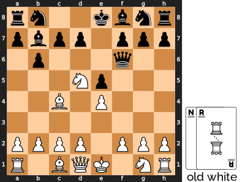

Black is threatening to capture the king with two queen moves, so White should
probably play a queen card to block. Black is also threatening White's knight
and bishop with two bishop moves, so White decides to play bishop and queen
cards.

Black decides to save the queen for next turn, so they won't have to leave it on
the table. Instead, they play the bishop to stop White from threatening the
king or bishop. White's only two-move threat on the king is the knight, which
they can't play this turn, so White plays a rook to avoid any chance of both
cards matching and skipping a turn where they have more information.

When the cards are revealed, the bishops cancel each other, leaving Black with
two rook moves, then White with two queen moves. Black uses the rook card to
move a pawn and then a rook: moving the h7 pawn forward two, then following it
with the rook. White decides not to capture the black
queen or the black rook, because the queen would almost certainly be captured
next turn. Instead, they move the c2 pawn and bring the queen out that way:

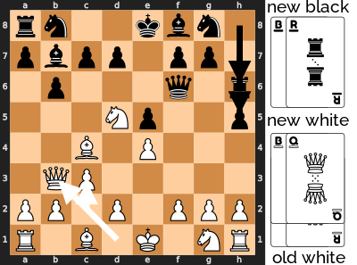

### Rules Quiz
Here are some examples that you can use to check if you understand the rules.

With these cards revealed, Black should be careful. There's a move that seems to
protect their queen and threaten the white king, but actually lets White capture
the black king. See if you can find the move to avoid and a better option:

Here's the move that might look good, but gives the game to White:

Because the two queen cards cancel each other out, Black gets to play the bishop
card twice, then White gets to play the rook card twice.

Because Black takes both of White's movable pawns at e4 and f3, the bishops are
now White's least valuable, movable piece type, and White can use any card to
move them. White can capture the pawn at e7, and the king at f8.

Here's a better move that will probably lead to a win for Black in the next turn
or two:

As tempting as it is to capture a pawn or two, blocking your own last pawn can
make all your cards more powerful. Here, it lets Black move the knight next turn
with any card. As long as they can avoid giving White a double bishop move, they
should be able to capture the black king with any two cards.

Most games will end with a double move to capture the king, but if you can
survive until most of the pawns are captured or blocked, be very careful of the
last pawn or two and the transition to freely moving more valuable pieces.

The challenge in the next example is to find a winning turn for White:

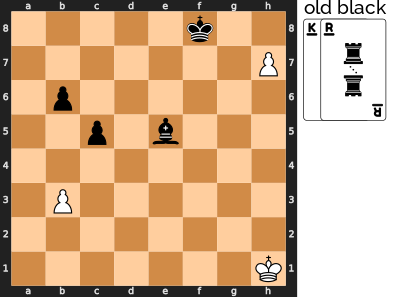

The solution is to remember that a pawn can be promoted to any other piece when
it reaches the back rank. There are two ways that black can try to stop White:
move the bishop to block at h8 or play a queen card to block the queen that the
pawn will get promoted into. To avoid the blocking bishop, White can play a
bishop card. To avoid getting the new queen blocked, White can play a rook card
and promote to a rook instead:

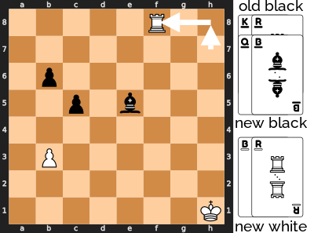

## Adrenaline Chess
What if taking your opponent's piece frightened the others so much that they
became more aggressive? Every time you take a piece, you have to choose one of
the remaining pieces to get an adrenaline rush, and adrenaline can make any
piece a king. This game adds a little chaos to chess, and accelerates the end
game.

### Equipment
A standard chess set and a standard set of 24 checkers. The checkers
must be stackable, and you must be able to stack a chess piece on top of the
checkers. Coins or poker chips would also work, as long as they fit inside the
chess board squares.

### Setup
Set up the chess pieces in the standard start position, and randomly choose who
will play white. Place the checkers beside the board.

### Play
All the regular chess rules apply, plus you must give an adrenaline rush after
captures. If you captured one or more pieces, end your turn by placing a
checker under one of your opponent's remaining pieces. The colour of the
checker doesn't matter, and you may stack multiple checkers under a piece.

In the following example, white just captured a pawn with the bishop, and
finishes the turn by adding a checker under the pawn at h7.

To move a piece with checkers under it, you must make a regular move for that
piece, and bring the checkers along. Then you may use up one of the checkers
under that piece to make an extra move like a king. Remove a checker from the
stack, and move the rest one space in any direction. If that piece still has
checkers under it, you may continue making extra king moves until the piece
runs out of checkers.

The extra moves may capture pieces, but you only ever add one checker per turn.
When you capture an opponent's piece, your capturing piece keeps any adrenaline
the captured piece had, and may immediately use the adrenaline.

For example, here is a strange checkmate that uses white's adrenaline to
threaten the white king. Black has just captured a pawn, and has spent the last
few turns pumping a trapped bishop full of adrenaline. Adding a third checker
to the stack at c1 would seem to make the bishop a threat to the black queen,
but it must make a regular move before it can start using the adrenaline. White
has been forced to keep the king retreating, and hasn't been able to move the
pawns that would free the bishop. The black queen on the other hand, will be
able to capture the bishop on the next turn, and then use those three checkers
to capture the king at f2, possibly capturing the pawn at d2 along the way.
Moving the king to e1 or e3 would still be in range for the queen. e2 would be
a direct capture by the queen, f1 and f3 could be captured by the queen or the
black bishop. g3 might give a glimmer of hope, until you notice that the black
pawn at h5 has a checker. It is checkmate.

You may not castle, if either the king or the rook has checkers. During
castling, you may not move your king through squares that could be attacked by
extra moves. You may capture a pawn en passant at the usual square after a
regular move of two squares. You may not capture en passant if the pawn used an
extra move, and you may not use an extra move to capture en passant. A pawn that
moves to the back rank immediately promotes, and may continue making king moves,
if it still has checkers. You may not move a piece to reveal a check on your
king, even if you then use an extra move to block the check again.

### Winning
Win by checkmate, as in regular chess, but you may use extra moves to threaten
the king.

## Tar Pit Chess
Your checkers can cover your opponent's pieces in tar to slow them down, and
your cards limit where you can play those checkers.

### Equipment
A standard chess set, a standard checkers set, and a standard deck of cards.

You must be able to stack a chess piece on top of a checker. Coins or poker
chips would also work, as long as they fit inside the chess board squares. You
need 12 each of two colours.

From the deck of cards, use one card to represent each piece, as shown in
appendix A. You also need two cards of each colour to represent checkers, so add
the sixes to the deck. That should make 36 cards in total, put the rest of the
deck aside.

### Setup
Set up the chess pieces in the standard start position, and randomly choose who
will play white. Place 6 light checkers in front of White and 6 dark checkers in
front of Black. Keep the extra checkers in a separate pile, but within reach.

Shuffle the deck and deal 6 cards to each player. Look at your cards, but don't
show them to your opponent. Place the rest of the cards in a draw stack.

### Play
Your turn has up to four parts:

* You must **move** a chess piece.
* If the piece you moved has your own checker under it, you may **throw** the
  checker under a neighbouring piece.
* You may play a card to **add** a checker.
* Finally, **draw** cards until you have one card for every checker in front of
  you.

#### Moving and Throwing
Chess pieces move normally, unless they are stacked on checkers. Pieces on
checkers are modified as follows:

* Your piece on your checker is carrying a bucket of tar: after moving your
  piece normally, you may throw the tar at one of your opponent's pieces or pass
  it to one of your own. Move the checker like a king, one space in any
  direction, to place it under another piece of either colour. Leave your
  chess piece where it ended its move. You can only move a checker under
  another piece, it can't sit alone on a square.
* Your piece on your opponent's checker is tarred: pawns cannot move at all,
  and other pieces move like pawns.

When you move a piece on a checker, it brings its checker along with it. If you
move a tarred piece all the way to your back rank, remove the checker and return
it to your opponent, a bit like promoting a pawn.

If your opponent adds a checker to your piece that's already on your back rank,
the opponent's checker is immediately removed. If your piece had one of your own
checkers, that's also removed.

#### Adding and Capturing Checkers
After you finish moving and throwing, you may play one of your cards to add a
checker. You may only add checkers of your own colour, and you may only add
one to a piece that matches the card.

Checkers cards change how many cards and checkers you have. If you play your own
colour checker card, place one of your extra checkers in front of you. Then draw
cards until you have the same number of cards as you have checkers in front of
you. If you play your opponent's colour checker card, they have to return one
of their checkers to the extra pile. It can come from in front of them or on the
board. If they now have more cards than checkers in front of them, they must
discard a card of their choice.

If there are no pieces left on the board to match a card, it can match any of
your pieces.

Play your card to a discard pile next to the draw pile, and shuffle the discard
pile to make a new draw pile if it runs out.

Say "No card," if you choose not to play a card.

When you capture a piece, your piece keeps any checker that the captured piece
was stacked on. Capturing a carrying piece leaves you tarred, and capturing a
tarred piece leaves you carrying.

#### Drawing Cards
After moving a piece and possibly playing a card, draw cards until you have the
same number of cards as checkers in front of you. In practice, this means that
you only draw after checkers combine and get returned or after playing a
checkers card.

Here's an example that shows all four parts of a turn:

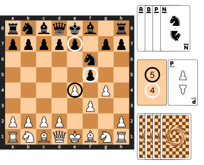

It's Black's turn, and the diagram shows Black's hand, as well as the card that
White discarded on the previous turn. It also shows the back of White's hand and
each player's stack of available checkers.

Black **moves** the knight to e4, and captures a pawn plus a black checker. The
knight is now carrying a bucket of tar.

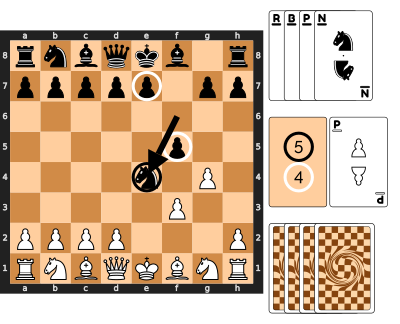

Black **throws** the tar that was just captured onto the pawn at f3. Now the
pawn can't capture the knight.

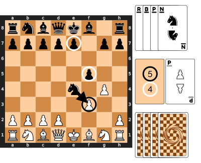

Black **adds** a checker at e4, by playing a black knight card.

Finally, Black has three cards and four checkers in front of them, so **draws**
one card.

#### Multiple Checkers
Chess pieces may never have more than one checker under them. When you capture
or add a checker, it may have to combine with a checker that was already there:

* Checkers of opposite colours cancel out. Return both to their owners.
* Checkers of the same colour repel each other. Return one to its owner, and
  keep one under the piece.

You may play a card to add a checker to a piece that already has your checker
under it, but you immediately get the checker back. That can be a way to cycle
through the cards, if you're hoping to draw something better.

Here's a different way to play a card in the example above. Instead of adding a
checker to the knight at e4, Black plays the black pawn card to add a checker to
the pawn at f5. The black checker immediately cancels out the white checker that
was there, and both are returned to their owners.

Now, White can still capture the pawn at f5, but can't also throw tar at the
knight. Black still has the black knight card to add a checker on a later turn
that might be in a good position to tar the white king.

#### Removing Tar
As a reminder, there are four ways to remove the checker from one of your tarred
pieces:

1. Play a card that matches the piece. Your added checker will cancel out the
   tar checker.
2. Move one of your carrying pieces next to your tarred piece, and pass your
   checker to it. Your passed checker will cancel out the tar checker.
3. Capture one of your opponent's pieces that is tarred with one of your
   checkers. Remember that a tarred piece can only capture like a pawn: one
   space diagonally. The captured checker will cancel out the tar checker.
4. Move the tarred piece like a pawn, all the way to your back rank, and then
   remove the checker.

Only the first two are possible for tarred pawns, because they can't move at
all.

#### Special Cases
You may not castle, if either the king or the rook have a checker.

Tarred pieces move like pawns, but do not move two spaces on their first move. A
tarred piece may capture an enemy pawn en passant.

### Winning
Win by checkmate, as in regular chess. Tarring the king makes it much easier to
checkmate. Carrying a bucket of tar makes the king much harder to tar.

### Variants
Make the game more predictable by using fewer checkers cards in the deck or
fewer checkers during setup. Make it less predictable by using more. Handicap a
player by giving them fewer checkers than their opponent. During setup, always
deal one card for each checker.

## Chess Golf
All the players try to work out the most efficient way to capture the chosen
pieces, using all the wrong moves. This game is a series of puzzles, so let's
start with an example:

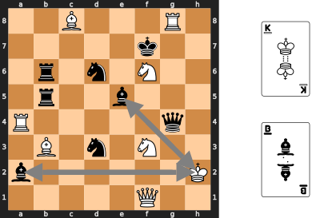

Every puzzle starts with the pieces spread around the board, and some cards
choosing types of pieces. The goal is to make one chosen piece type capture the
others in as few moves as possible. In this example, you have to make the white
king capture one of the black bishops or make one of the black bishops capture
the white king.

You might think that the bishop at e5 could directly capture the king, but in
this game, the piece's original movement is irrelevant. Pieces can only
**borrow** a move from a neighbouring piece in the 8 squares immediately
surrounding them, a bit like a golfer takes a golf club from the caddy standing
next to them. That means that the bishop at e5 can only move like a knight and
the king can't move at all. Also, pieces can only borrow moves from a
neighbour that's the **same colour**, so the bishop at a2 can't move at all.

Now that you know how the pieces move, here's one possible solution:

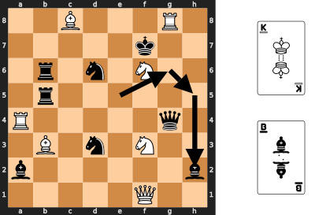

The bishop moves like a knight to g6 and then moves like a king to h5. Then it
borrows the queen's move to capture the king at h2. The solution takes 3 moves.

You're not limited to moving the two chosen piece types. Here's a 3-move
solution where a chosen piece type only makes the final capture move:

The white bishop uses the rook's move to get out of the way, and then the black
rook comes down to b3. The bishop at a2 can now use the rook's move to capture
the king.

There are solutions that help the white king capture a black bishop, but they
take at least 4 moves.

Now that you've seen how to solve one of the puzzles, the rest of the rules
explain how to solve a series of these puzzles with a group of players, keeping
score like a round of golf.

### Equipment
A standard chess set and a standard deck of 52 cards. You'll also need a pencil
and paper for keeping score, a timer, and some coins. 4 coins are probably
enough, and you can even play without them. A one-minute timer works well,
although anything from 30 seconds to two minutes would be fine.

### Setup
Place all the chess pieces except the pawns beside the board. Put the pawns
away, you won't need them.

Use the custom deck of chess cards, or see appendix A for how to use a deck of
standard playing cards. Use one card to represent each piece, but you don't need
the pawn cards, so you should end up with 16 cards.

Put the rest of the cards away, you won't need them. Then shuffle the cards and
place them next to the board. Draw one card at a time, placing the matching
piece on the board. Start at a1 through h1, then wrap around to a2 through h2,
all the way to h8. The pips in the centre of the chess cards or the table in
appendix A show how big a gap to leave before each piece. That is, how many
empty squares to leave before placing each piece.

Here's an example with all the cards laid out in the order they were drawn, from
the white bishop to the white queen. Check to make sure you agree with where the
pieces were placed.

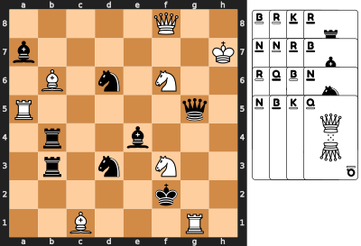

When all 16 pieces are on the board, randomly choose a dealer to shuffle the
cards again.

Also choose a scorekeeper, and get them to write everyone's initials at the
top of the paper, leaving enough room for 9 scores and a course total.

### Play
On the first turn, the dealer will **draw** two cards and place them face
up next to the board where all players can see them. Check appendix A if you
need to, and **announce** the two chosen piece types for this turn.

All players try to **solve** the puzzle in as few moves as possible. While
solving, no one actually moves the pieces. Just visualize how the pieces will
move and count how many moves you need to capture one of the piece types with
the other.

When you **find** a solution and count the moves, start the timer, then put your
fist on the table to show that you're ready. When all the players have a fist on
the table or when the timer runs out, the solving phase ends.

Now, everyone **reveals** their move count at the same time. Bang your fist on
the table as you count "one, two, three." As you say "three," everyone puts out
a number of fingers to show how many moves they need. The scorekeeper writes
down everyone's number as their score for this hole. If you think it's
impossible, or you just couldn't find a solution, keep your hand in a fist as a
zero.

The player with the fewest moves, but not zero, must now **demonstrate** the
path. If some players are tied for fewest, start to the dealer's left and go
around to the left until you reach one of the tied players. That player must
demonstrate. It can be helpful to start by placing coins under all the pieces
that you're going to move, so you can reset if you get confused.

Players should not be allowed to hesitate more than a few seconds while
demonstrating. Be kind, especially to younger players, but they can't sit and
try to solve it at this point.

If the player can't demonstrate their path, then they get the maximum of all the
other players' numbers, plus a one-point penalty. Reset the pieces to where
they started and get the player with the next lowest number to demonstrate.

If some players say it's impossible, let the player with the lowest nonzero
number demonstrate. If they are successful, then all the players with a zero get
the maximum number plus a one-point penalty.

After a successful demonstration, leave the pieces in their final positions, and
add any captured pieces back to the board in any empty squares. Remove the
coins, if you used them. The scorekeeper adds any penalty points for players
who failed to demonstrate or thought it was impossible when it wasn't. **Pass**
the deck to the player who demonstrated, and they become the new dealer.

If everyone thought it was impossible, everyone gets zero points, and the same
dealer deals again.

### Special Move
The basic moves are to borrow a move from a neighbouring piece of the same
colour. You may only capture one of the chosen piece types with the other one.
No other captures are allowed.

In addition, there is one special move to help when you get stuck: if one of the
colours has no pairs of pieces next to each other, then any piece of that colour
may make a king's move. Just because one piece has no neighbours of the same
colour, it doesn't necessarily get to make a king's move. Only if a colour has
no pairs of pieces next to each other, then all the pieces of that colour may
make a king's move.

For example, in the position below, neither the white knights nor the black
queen has any neighbours of the matching colour. One way to move them is
bringing in other pieces to borrow moves from. However, there's an easier way.

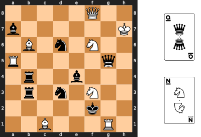

Moving the bishop breaks the last pair of neighbouring white pieces, so the
white knight at f6 can now use a king's move to capture the black queen.

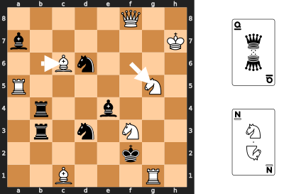

### Difficulty Level
Once you've played a few holes, and all players understand the rules, the dealer
may choose to increase the difficulty level on any hole by dealing three cards
instead of two. One of the chosen piece types must capture **both** of the
others.

### Game End
Continue dealing new cards each turn until you have played 9 turns. If you
don't have enough cards to deal, shuffle the discard pile back in before you
deal. Add up the points for all 9 turns, and award the game to the player with
the lowest score.

A tie goes to the best dressed player.

### Problems
Here are some positions that are more challenging than average. The chosen
pieces are circled, and solutions are given at the end of the book. See if your
solutions are as short.

#### Problem 1

#### Problem 2

#### Problem 3
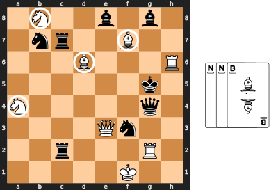

## Crowded House
Two teams of two play, with each player moving the pieces of their colour
on the left or right half of the board. As usual, white moves first, then
alternates with black. Each king-side player takes the first move for their
team, then alternates with their partner.

In the following example, Walter plays king-side white, Winnie plays queen-side
white, Betty plays king-side black, and Bob plays queen-side black. Then the
play order would be Walter, Betty, Winnie, Bob, Walter, Betty, and so on.

### Rule changes
The key rule is that you may only move a piece that either

* **starts** on your side of the board, or
* **ends** on your side of the board.

In this example, Winnie may move any piece that starts or ends on the queen
side of the board, shown by the dashed rectangle. She may move the bishop as
shown by the arrow, because it ends up on the queen side of the board. Winnie
may not move the bishop to e2, because it would start and end on the king side.

If a player has no pieces on their side and can't move any pieces to their side,
they move nothing on that turn.

The rest of the rule changes flow from whether a piece may be captured
immediately. A king may move into check or castle out of check, if the next
player can't make the capture. En passant capture only works if the pawn is
captured immediately after its first move.

### Winning
Win by check mate, as usual, but remember that the next player on the attacking
team has to be able to make the capture.

### Talking
This game shouldn't be taken too seriously, so feel free to chat with your
partner, but remember that the other team is listening. Any discussion should
be heard by both teams, so no secret codes or second languages! Of course,
players should also feel free to ignore their partner's advice.

## Cooperative Chess
If you don't like battling your friend across the board, you can team up against
the game itself. A hand of cards limits what you can capture, and you work
together to eliminate as many *types* of pieces as you can.

### Equipment
A standard chess set and 32 cards from a standard deck of 52 cards. You will use
cards to match the chess pieces, as shown in appendix A.

### Setup
* One player **stands** the chess pieces in the standard start position.
* Meanwhile, the other player **shuffles** the 32 cards,
* **deals** 3 to each player, and
* **places** the rest of the cards next to the board as a draw pile.
* When the chess pieces are set up, the first player secretly places a white
  pawn in one hand and a black pawn in the other. The other player then
  **chooses** a hand to decide their colour.

### Play
White plays the first turn, and then players alternate. Each turn has four
possible steps, in this order:

1. You may make a **non-capturing** chess move.
2. You must **play a card** from your hand to your discard stack.
3. You may make multiple **capturing** chess moves, if the cards allow.
4. You must **draw a card** to bring your hand back to 3.

As the game progresses, you will move the cards between three face-up,
spread-out stacks of cards: White's discards, Black's discards, and the captured
cards. It's best to spread the cards enough that you can see which cards have
already been played.

The chess pieces make the same moves as in regular chess, but you can only
make a capture if the cards match:

1. The **capturing** piece must be the same piece type as the card that the
   capturing player just played, and
2. the **captured** piece must be the same piece type as the top card on the
   other player's discard stack.

Pieces may match cards of either colour. On each turn, all moves must be made
with one piece.

When you capture a piece, remove the piece from the board, and move the captured
piece's card from your partner's discard stack to the captured cards stack. If
you can make another capture move that matches the next card in your partner's
stack, you may continue.

As an example, imagine that black has a knight card, a bishop card, and a king
card in hand with the following position:

They can move the bishop to e6, play their bishop card, and then capture both
pawns.

The king can't get close enough to attack this turn, but the knight card
might be an even better option:

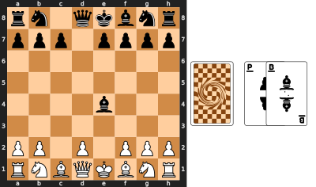

Now the knight can be attacked by anything except a pawn or a rook, and it can
attack anything except a queen.

There are two types of **wild** cards that can match any piece type. They may
match different piece types when they capture and when they are captured.

1. If you no longer have any pieces of a certain type, then that type of card is
   wild on your discard stack. For example, if you have no queen, then a queen
   card on your stack lets you capture with any piece and lets your partner
   capture any of your pieces.
2. A double colour match makes the next capture wild. If both the capturing
   piece and the captured piece match the colour of their cards, then the next
   captured card becomes wild, as long as you can capture it in the same turn.
   White pieces match red cards.

In this slight change from the previous example, you might think that black can
only capture one pawn.

However, since white's pawn card matches colour, black can make the rook card
wild by using a black card to capture a white pawn. Black could do either of the
moves shown before, or even capture something bigger than a pawn:

Castling is allowed. En passant capture is allowed. You may promote a pawn on
the last rank to any other piece. It can be an effective way to get rid of your
last pawn. You may move a king into check or leave it in check.

### Winning
The game ends immediately when you capture a king. You then get a point for each
piece type that was completely removed from the board, both colours. For
example, if you captured both queens, all four bishops, and a king, but still
had at least one pawn, one knight, one rook, and the other king still on the
board, then you would score 2 points.

If the draw pile is empty, continue playing until you run out of cards in your
hands. If you run out of cards without capturing a king, you lose.

### Talking
The game works best if players know something about each other's cards, but not
everything. They should feel free to ask each other yes or no questions about
their hands and to discuss general strategy, but shouldn't just reveal their
hands.

# By Other Designers
## Half Alice Chess
Alice Chess is a popular variant invented by Vernon Parton in 1953, usually
played with one set on two boards. Since I wanted all the games in this
collection to be playable with one chess set, I found a way to play it on one
board by placing the mirror pieces on checkers. I'm not the first to suggest
this idea, but I think it makes it easier to see the connections between the two
sets of pieces.

The main idea is that pieces switch back and forth between the two sides of a
mirror, as in Lewis Carroll's "Alice Through the Looking Glass". This causes
many surprising positions and interactions, well worth exploring.

### Equipment
A standard chess set and a standard checkers set. For full compatibility with
the original rules, you'd need 16 checkers of each colour, but I think it's
unlikely you'd ever need more than the standard 12.

### Setup
Place the chess pieces in their standard opening position, give the light
checkers to White and the dark checkers to Black.

### Play
Pieces not on checkers are on one side of the mirror, pieces on checkers are on
the other side of the mirror. Rules are as in orthodox chess, with these
changes:

* The move must be legal under orthodox chess rules.
* Switch the moved piece to the other side of the mirror after it moves. (Add or
  remove a checker.)
* Pieces cannot capture pieces on the other side of the mirror, but they can
  move through squares that are occupied by pieces on the other side of the
  mirror.
* If you're playing with 12 checkers each, then you must have a free checker in
  order to move a piece without a checker.

### Winning
Place the opponent's king in checkmate. A king may not evade check by switching
to the other side of the mirror, because the move must be legal before the
switch.

In this example, the king cannot move to a8, because it would still be in check
by the queen before switching. It can't move to b7, because it would be in check
by the rook after switching.

The only legal move is to a7.

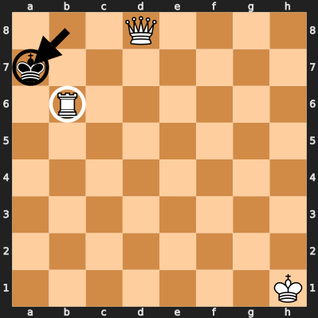

## Chess960
This is probably the least silly game in the collection; people organize
Chess960 tournaments! It's still a bit silly, because it takes away the standard
"opening book". One of the challenges to learning chess is that strong players
have spent a lot of time studying standard openings. That can also make the
early game feel like you're following a script. Randomizing the starting
position should make the standard openings much less important and make the play
feel more creative.

### Starting Position
The idea of randomizing the starting position has been around since the 1790s,
but Bobby Fischer added some restrictions in the 1990s to avoid positions that
strongly advantage one player:

* Pawns start in their regular position.
* The two bishops must be on different colours.
* The king must be between the two rooks.
* As in the standard starting position, black's pieces are a mirror reflection
  of white's.

With those restrictions, there are 960 possible starting positions. You can
generate a random number and look up the position in a table, or use a website
like [mark-weeks.com][weeks] to generate a position. You can also generate a
random starting position with a standard deck of playing cards or with the deck
of chess cards. If you have a standard deck, create three piles of cards with
the following ranks, ignoring suit:

* A, 3, 5, 7
* 2, 4, 6, 8
* 8, 8, 10, 10, 10, Q

If you have chess cards, use black pieces for the first two piles. One with
odd numbers of pips and the other with even numbers. You'll need to use the
black checkers cards, as well. The third pile is white pieces, minus the king
and bishops, plus one black rook.

* Black, odd pips: 1, 3, 5, 7
* Black, even pips: 2, 4, 6, 8
* White pieces: N, N, Q, R, R, plus black R

Shuffle each of the piles separately, then turn over one card from each of the
first two piles. Using the ace through 8 or the pips to represent the squares a1
through h1, place the two white bishops on the squares that match the two cards.
Confirm that they are on opposite-coloured squares. Now turn over one card at a
time from the last pile, and use the identified white pieces to fill in the
empty squares from left to right. If you have a standard deck, place a knight
for an 8, a queen for a queen, and a rook for a 10. For the three rook cards,
place the king in the middle and the rooks on the outside. Finally, place the
pawns in their regular positions and place the black pieces to mirror the white
pieces.

As an example, imagine you turned over a 1 and a 6 from the first two piles,
then N, R, Q, R, N, R from the third pile. The starting position would look
like this:

### Castling
The other change that Bobby Fischer made was to the castling rules. As usual,
the king may castle with the rook to his right or his left. However, the two
pieces' end positions after castling are the same as for standard chess. So to
castle with the a-side rook, white's king would end on c1 and the rook on d1, no
matter where they started. In the example above, white's third move could be to
castle.

As in regular chess, there are several restrictions
before you can castle:

* The king and the rook must not have moved.
* The king's starting square, ending square, and all the squares he moves
  through must not be under attack.
* All the squares the two pieces move through must be empty, except for the two
  pieces themselves.

The rest of the standard chess rules apply unchanged.

[weeks]: https://www.mark-weeks.com/cfaa/chess960/c960strt.htm

## Synchronous Chess
There have been a few attempts to remove the first player's advantage by making
moves simultaneously, and this is my favourite. Its history is a bit murky, but
my best guess is that it was designed in 1991 by Vitaly Korolev. Then Ralf
Hansmann, Arnold J. Krasowsky, and Andrey Krasowsky removed some special cases
and added an exchange of blows after the simultaneous moves.

Two Move Chess also has simultaneous choice of which pieces to move, but then
moves are made in a defined order.

### Equipment
A standard chess set, plus paper and pencil for each player.

### Setup
Start with the regular opening position.

### Goal
Capture the opponent's king, or checkmate it so it is under attack and has no
safe move.

### Play
The same moves are legal as in regular chess, but both players write down a move
at the same time, then reveal them. Feel free to use any chess notation familiar
to both players. The moves are resolved in one of three ways:

1. If a move ends on a square that was occupied by a piece of the opposite
   colour, and that piece didn't make a move at the same time, then it is
   captured as normal.
2. If a move ends on a square that was occupied by a piece of the opposite
   colour, and that piece made a move at the same time, then it is not captured.
   This means that two pieces may swap positions, if they try to capture each
   other, and pieces sometimes move through each other.
3. If both moves end on the same empty square, then both pieces are captured.

Remember that a move must be legal in regular chess, before the opponent's piece
moves.

After resolving the synchronous moves, check to see if an exchange of blows is
possible. This happens if either piece has moved to a square that was attacked
by an opponent's piece before the move and is still attacked by the same piece.
The opponent has the option to capture the piece that just moved. If they do so,
check to see if the original player can now capture on the same square. This
continues until no more captures are possible on that square, or a player
decides not to capture. Each piece may only move once during an exchange of
blows. The pieces that made simultaneous moves may participate in an exchange of
blows, if they have a legal attack.

If both players have the option to exchange blows, they should write down their
moves at the same time, then reveal them. To pass, just write an X.

If a king is under attack, it must move to a square that is not under attack
before the move. Moving a piece to block the attack isn't legal, because the
attacker could move at the same time. If a king has no safe squares to move to,
then it is checkmate. Castling out of check is not legal, because all moves must
be legal in regular chess.

There is no "en passant" capture. If you don't know what that is, you can safely
ignore it.

If both kings are checkmated at the same time or captured at the same time, the
game is a draw.

If a king and any other piece move to the same square, both are captured and
capturing the king is a win.

All the regular causes of draws are still in effect: repeated positions or many
moves without any pawn progress.

## Appendix A
Several of the games require a deck of cards to match each chess piece. There
are a few options to choose from:

* Use standard playing cards, and memorize which cards match which pieces, as
  shown in the table below.
* If you don't mind defacing a deck of cards, write the letters for the chess
  pieces on the cards, as shown in the table below. Press lightly to avoid
  marking the back of the cards.
* Download the chess deck PDF from
  [https://donkirkby.github.io/chess-kit][github], print out the cards on card
  stock, then cut them out.

If you're going to use standard playing cards, these tables show the cards that
match each type of chess piece or checker. Some of the games also use cards to
randomly lay out the pieces on the board, and these tables show how big a gap to
leave before each type of piece. That is, how many empty squares to leave before
placing the piece.

The cards with small numbers match pawns. Kings and queens are obvious, and the
other pieces are sorted by strength to match the number cards from 8 to 10.
In the games that use checkers, they match 6s and 7s.

Black cards match black pieces:

Red cards match white pieces:

## Solutions
### Chess Golf Solutions
Here are the solutions to the Chess Golf problems.

1. d3b5, a5c6, c6e7, g3g4, g5f6, e7g8
2. e3g3, g1b6, c7f4, g4e5, f4e6, e6f8, f8g7, g7e5
3. g2f2, e3e7, f7b3, a4d7, d7d6, d6d8, d8b8

### Contributing
Know some other lighthearted chess variants? Ideas to share? Get in touch at
[https://donkirkby.github.io/chess-kit][github].

Zombie Chess, Masquerade Chess, Two Move Chess, Adrenaline Chess, Tar Pit Chess,
Chess Golf, Crowded House, and Cooperative Chess are original games designed by
[Don Kirkby][don].

[github]: https://donkirkby.github.io/chess-kit
[don]: https://donkirkby.github.io/

[![cc-logo]][cc-by-sa]

[cc-logo]: images/cc-by-sa.png
[cc-by-sa]: https://creativecommons.org/licenses/by-sa/4.0/
