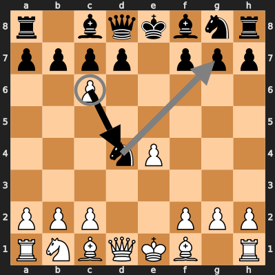

### Introduction
I am not a strong chess player - it's always seemed to me more like study than
play. However, I do like the ideas in chess: a ragtag army of pieces with
different moves, battling to protect their king. I wondered if I could take
those ideas that many players are already familiar with, and mix them together
with some newer game mechanics from the last 500 years of board game design.
This collection contains chess games I've designed with hidden information,
bluffing, deduction, role selection, and yes, zombies. They can all be played
with a standard chess set and common items like pencil and paper, coins, and
playing cards.

Hopefully, serious chess players can enjoy these as a light break between
regular chess games, and new chess players can use them as a gentler
introduction to the classic game. Players of different chess abilities that
might find a game of regular chess frustrating may enjoy exploring these games
together.

## Table of Contents

* [Zombie Chess][zombie-chess] is a game where you bury each piece you
    capture under one of your pieces. If you move off a buried piece, it
    comes back from the dead as a zombie. (2 players, chess set, coins,
    pencils, and paper)
* [Masquerade Chess][masquerade-chess] is a combination of chess and
    deduction games like Mastermind. Pieces move regularly, except when
    they capture. Start the game by choosing which capture moves each of
    your opponent's pieces will use, then try to deduce how each of your
    pieces can capture. (2 players, chess set, pencils, and paper)

[zombie-chess]: #zombie-chess
[masquerade-chess]: #masquerade-chess

## Zombie Chess
Just because you've captured a piece doesn't mean you can stop worrying about
it. In Zombie Chess, it can come back from the dead and shamble across the board
until you destroy it permanently.

### Setup
Set up the chess board normally, and gather a few coins. Four is usually enough.
Each player will also need paper and pencil to draw an 8x8 grid to record where
you secretly bury your opponent's pieces. Make it big enough to write a single
letter on each square. You can also draw a second grid, if you want to track
where your own pieces might be buried. The grids will be empty at the start of
the game.

Place the coins on one side of the board to mark the graveyard of zombie pieces.
The other side is the dust bin for destroyed pieces.

### Play
All the normal rules of Chess apply, until you capture a piece. In addition to
moving the captured piece to the graveyard of zombie pieces beside the board,
you have to secretly bury it under one of your pieces. Choose one of your
pieces, then find its matching square on your paper grid. Write the first letter
of the buried piece there, or N for kNight. Don't let your opponent see where
you buried the piece.

In this example game, Black has just captured a pawn at d4 and buried it under
the knight at c6.

At the end of your turn, check to see whether there was a piece buried under the
piece you moved. If not, say "no zombie" and say the coordinate you checked. If
there is a piece buried there, bring it back from the zombie graveyard to the
square on the board where it was buried. Place a coin under it to mark it as a
zombie, and erase it from your grid.

The next turn in the example game, White uses the knight at f3 to capture the
pawn at d4. First, they check for zombies. There are no black pieces in the
graveyard, so they say "no zombies". Then, they choose where to bury the pawn.
They decide to bury it under the pawn at b2, so they write a P in their hidden
grid at b2.

Black responds by capturing the knight at d4 with their knight at c6. First,
they check for zombies. There is a white pawn in the graveyard, so they check
their secret grid for the square they just left: c6. They see the P there, so
they put the white pawn back on the board with a coin under it and erase it from
the grid. Then they decide to bury the knight under the pawn at g7 and write
an N in that square in their hidden grid.

Also at the end of your turn, check if you have any zombie pieces that you
didn't move. If so, they are permanently destroyed, and moved to the dust bin
side of the board.

If you have more than one zombie piece on the board, they form a zombie horde.
You can move all of them on one turn, although each piece can only move once per
turn. Any that you don't move will be destroyed at the end of your turn.

You probably don't want to bury pawns on your back rank, because they can
immediately be promoted when they come back and then moved on that turn. As with
regular chess, you can promote to extra queens. Either use a queen from another
set, or just keep track of which pawns have been promoted.

You can't bury more than one of your opponent's zombie pieces under one of your
pieces. However, you can leave that piece buried if your opponent captures your
piece on top of it. When they move off the space, first ask them if they
revealed one of your buried pieces. If so, it comes back, and you don't yet have
to reveal the piece you have buried there.

In the very unlikely event that you capture a piece and already have a piece
buried under each of your pieces, move it directly to the dust bin and say, "I
cannot bury this piece."

### Game End
As usual, the goal is to checkmate your opponent's king. If moving a piece would
put your king in check by revealing a zombie, you may not move that piece. When
castling, complete the move before revealing any zombies.

## Masquerade Chess
Masquerade Chess is regular chess, but all the pieces above pawns have a secret
identity. They use their standard moves, except when capturing. Each player
knows the capture moves of their opponent's pieces, but not their own. Who can
find their way to victory first?

### Setup
Players each draw two copies of this table:

They write their opponent's name above one table and their own name above the
other. They then fill in the table for their opponent's pieces without letting
their opponent see. Circle one square in each row and column to record which of
their opponent's pieces captures using which moves. Each row must have one
circle and each column must have one circle. A piece may be given its normal
capture or the capture from a different piece.

Players will fill in the other copy as they learn about their own pieces.

The combo column can be helpful to fill in with the move and capture letters
together, so players don't have to keep looking at the rows and columns of the
rest of the table.

Here's an example set up where Bob has filled in the table for Alice's pieces
and left his own blank.

#### Alice

#### Bob

### Play
On each turn, the player may either make a standard move without capturing, or
attempt a capture. To attempt a capture, point to the piece you want to move,
then to the piece you want to capture, and ask your opponent, "Capture?" If your
opponent says the move is legal, perform the capture as normal. If not, you
don't move anything, and your turn is over. Either way, record what you learned
in your table by writing X's for combinations that you know are impossible and
O's for combinations that you know are correct. Remember that pawns always
capture with their standard capture moves.

### Game End
The game ends when one of the players captures the other's king. Because players
don't always know their pieces' abilities, they don't have to call "Check", and
a threatened king doesn't have to evade capture. The king may choose to bluff by
staying where it is or even move into an attacked square. A king may castle out
of check. There is no stalemate between kings: one king can capture another to
win the game.

### Strategy
A key part of strategy is which capture moves to assign to which pieces. It
seems like it would be a big advantage to give your opponent two queens, so
perhaps the queen capture should always be assigned to the king or the queen. It
seems like giving it to the king makes it harder to use, because a long range
capture will likely leave the king exposed. However, a king with a queen capture
can defend itself very effectively.

The Queen can quickly get into position to attack, so it's probably wise to give
it a less powerful attack like the knight or king. However, even these can be
surprisingly effective.

When assigning capture moves to the bishop, knight, and rook, look at which
pawns they can defend. If you can make one of the pawns undefended and then try
to attack it with a knight, that can be a quick, safe way to learn about some of
your pieces.

As an example, KQ, QN, RB, NR, BK seems nicely balanced, and leaves the rook
pawns undefended. However, assigning the same moves every game would be too
predictable.

Another part of strategy is the effective use of bluffing. Keep track of what
your opponent knows about their own capture moves, and put your pieces in danger
if the risk is worth learning something valuable or attacking the king. Try to
learn faster than your opponent and strike before they know enough to defend
themselves. Move fast and break things!

### History
This game was inspired by Robert Abbott's Confusion, which Kerry Handscomb and
I originally adapted as Minor Confusion by creating a more balanced set of moves
and playing with a chess set. That was playable, but uninspiring, so I abandoned
it for 15 years. Masquerade Chess returns to the standard Chess moves, and
players only learn about their pieces during capture, which slows the pace of
the game.

[![cc-logo]][cc-by-sa]

[cc-logo]: images/cc-by-sa.png
[cc-by-sa]: https://creativecommons.org/licenses/by-sa/4.0/
